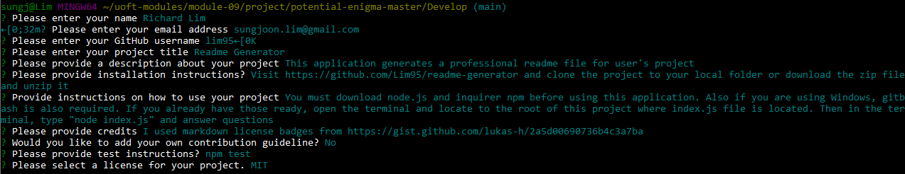

 
  # README GENERATOR
  

  ## Description
  This application generates a professional readme file for user's project

  ## Table of Content
  * [ Installation ](#Installation)
  * [ Usage ](#Usage)
  * [ Credits ](#Credits)
  * [ Contribution Guidline ](#Contribution-Guidline)
  * [ Tests ](#Tests)
  * [ Questions ](#Questions)
  * [ License ](#License)

  ## Installation
  Visit https://github.com/Lim95/readme-generator and clone the project to your local folder or download the zip file and unzip it

  ## Usage 
  You must download node.js and inquirer npm before using this application. Also if you are using Windows, gitbash is also required. If you already have those ready, open the terminal and locate to the root of this project where index.js file is located. Then in the terminal, type "node index.js" and answer questions

  ### Screenshots
  
  
  ### Walk-through video link
  https://drive.google.com/file/d/1U3kgLrt7A-sy7rLSg13U9o2IX2P7k6jK/view
  
  ## Contribution Guideline
  [Contributor Covenant](https://www.contributor-covenant.org/version/2/0/code_of_conduct/)
  
  ## Credits
  I used markdown license badges from https://gist.github.com/lukas-h/2a5d00690736b4c3a7ba

  ## Tests
  npm test

  ## Questions
  Contact the author with any questions! 
  Author: Richard Lim  
  Github link: [lim95](https://github.com/lim95) 
  Email address: sungjoon.lim@gmail.com

  ## License
  This project is [MIT](https://opensource.org/licenses/MIT) licensed. 
  
